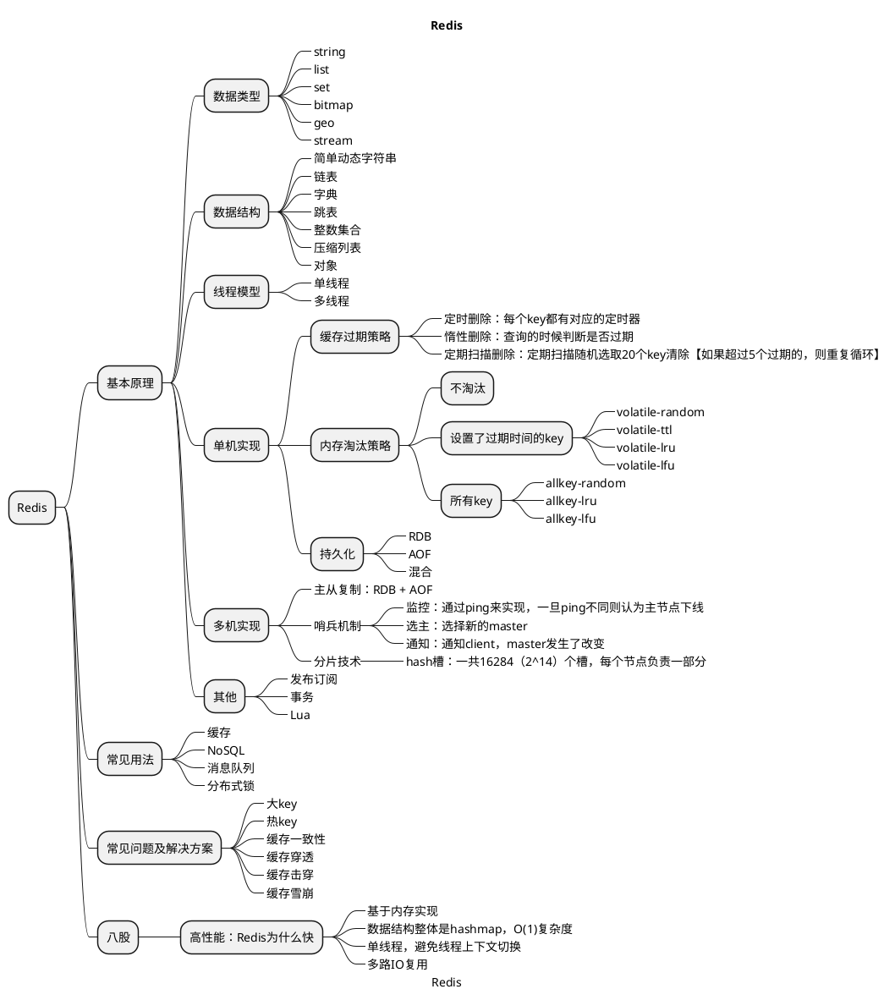

[Redis源码](https://github.com/antirez/redis)
# 知识盘点

```plantuml
@startmindmap
'https://plantuml.com/mindmap-diagram

caption Redis
title Redis

* Redis
** 基本原理
*** 数据类型
****_ string
****_ list
****_ set
****_ bitmap
****_ geo
****_ stream

*** 数据结构
****_ 简单动态字符串
****_ 链表
****_ 字典
****_ 跳表
****_ 整数集合
****_ 压缩列表
****_ 对象

*** 线程模型
****_ 单线程
****_ 多线程


*** 单机实现
**** 缓存过期策略
*****_ 定时删除：每个key都有对应的定时器
*****_ 惰性删除：查询的时候判断是否过期
*****_ 定期扫描删除：定期扫描随机选取20个key清除【如果超过5个过期的，则重复循环】

**** 内存淘汰策略
***** 不淘汰
***** 设置了过期时间的key
******_ volatile-random
******_ volatile-ttl
******_ volatile-lru
******_ volatile-lfu
***** 所有key
******_ allkey-random
******_ allkey-lru
******_ allkey-lfu

**** 持久化
*****_ RDB
*****_ AOF
*****_ 混合


*** 多机实现
****_ 主从复制：RDB + AOF
****_ 哨兵机制
*****_ 监控：通过ping来实现，一旦ping不同则认为主节点下线
*****_ 选主：选择新的master
*****_ 通知：通知client，master发生了改变
****_ 分片技术
*****_ hash槽：一共16284（2^14）个槽，每个节点负责一部分

*** 其他
****_ 发布订阅
****_ 事务
****_ Lua

** 常见用法
***_ 缓存
***_ NoSQL
***_ 消息队列
***_ 分布式锁

** 常见问题及解决方案
***_ 大key
***_ 热key
***_ 缓存一致性
***_ 缓存穿透
***_ 缓存击穿
***_ 缓存雪崩

** 八股
*** 高性能：Redis为什么快
****_ 基于内存实现
****_ 数据结构整体是hashmap，O(1)复杂度
****_ 单线程，避免线程上下文切换
****_ 多路IO复用

@endmindmap
```